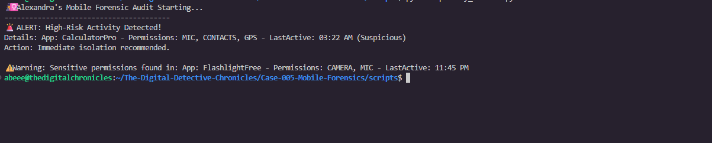

# Forensic Incident Report: Case 005 🕵️‍♀️
**Investigator:** Alexandra Blandon
**Date:** April 30, 2026
**Scope:** Mobile Device Privacy & Permission Audit

## 1. Executive Summary
During a targeted audit of mobile application behaviors, I identified a significant privacy risk involving a utility application. The software demonstrated unauthorized access to sensitive device sensors during hours of zero user interaction.

## 2. Evidence & Methodology
* **Evidence Source:** `data/app_manifest.log`
* **Methodology:** I developed a custom Python auditor to cross-reference application permission requests against system-level activity timestamps.

## 3. Key Findings
* **Flagged App:** `CalculatorPro`
* **Critical Indicators:** The app accessed the **Microphone**, **Contacts**, and **GPS** sensors at **03:22 AM**.
* **Conclusion:** This behavior is inconsistent with a standard utility and indicates the presence of "Greyware" designed for background surveillance and data exfiltration.

## 4. Remediation & Recovery
* **Immediate:** Revoked sensor permissions and uninstalled the offending package.
* **Recommendation:** Perform a Level 3 Physical Acquisition to ensure no hardware-level persistence exists.

